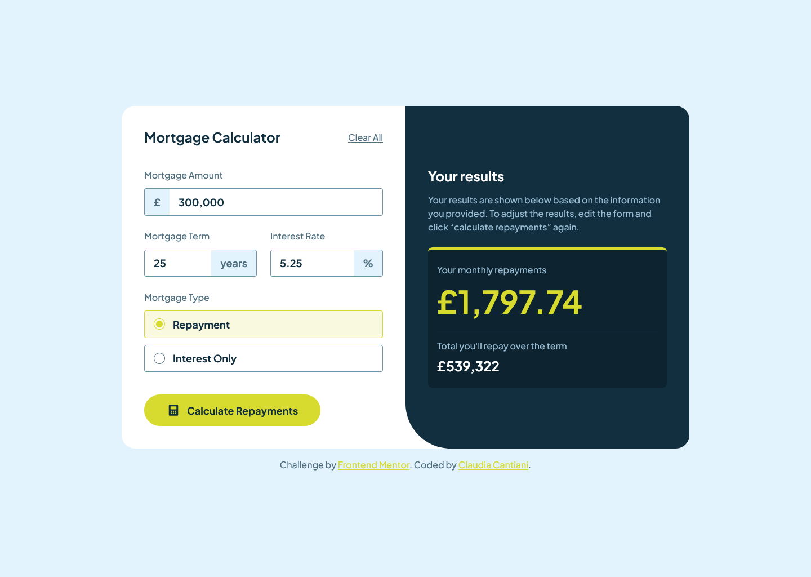
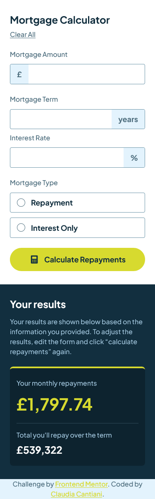

# Frontend Mentor - Mortgage repayment calculator solution

This is a solution to the [Mortgage repayment calculator challenge on Frontend Mentor](https://www.frontendmentor.io/challenges/mortgage-repayment-calculator-Galx1LXK73). Frontend Mentor challenges help you improve your coding skills by building realistic projects.

## Table of contents

- [Overview](#overview)
  - [The challenge](#the-challenge)
  - [Screenshot](#screenshot)
  - [Links](#links)
- [My process](#my-process)
  - [Built with](#built-with)
  - [What I learned](#what-i-learned)
  - [Continued development](#continued-development)
  - [Useful resources](#useful-resources)
- [Author](#author)

## Overview

### The challenge

Users should be able to:

- Input mortgage information and see monthly repayment and total repayment amounts after submitting the form
- See form validation messages if any field is incomplete
- Complete the form only using their keyboard
- View the optimal layout for the interface depending on their device's screen size
- See hover and focus states for all interactive elements on the page

### Screenshot

### Links

- Solution URL: [Add solution URL here](https://your-solution-url.com)
- Live Site URL: [live site URL](https://cla91.github.io/mortgage-repayment-calculator-main/)

## My process

### Built with

- Semantic HTML5 markup
- CSS custom properties
- Flexbox
- CSS Grid
- Mobile-first workflow
- Vanilla JS
- [Vite](https://vite.dev/) - Vite

### What I learned

During the development of this project, I gained a deeper understanding of several key concepts:

- Object-Oriented Programming (OOP) in JavaScript: I used an ES6 class, MortgageCalculator, to encapsulate the data and logic. This improved code organization and reusability.
- Modular JavaScript: By separating the calculator logic into its own class and using a Formatter utility, I created a more maintainable and scalable codebase. This is a crucial skill for building larger applications.
- Mortgage Calculation Logic: I learned the distinct mathematical formulas required for calculating repayment and interest-only mortgages. This highlighted the importance of tailoring logic to specific use cases.
- DOM Manipulation: I practiced selecting and updating DOM elements dynamically based on user input, ensuring the user interface reflects the calculated results in real-time.

### Useful resources

- [Gemini](https://gemini.google.com/) - This helped me for mortagage formulas, which I had no idea about.

## Author

- Website - [Claudia Cantiani](https://cla91.github.io/)
- Frontend Mentor - [@cla91](https://www.frontendmentor.io/profile/cla91)
- Github - [@cla91](https://github.com/cla91)
